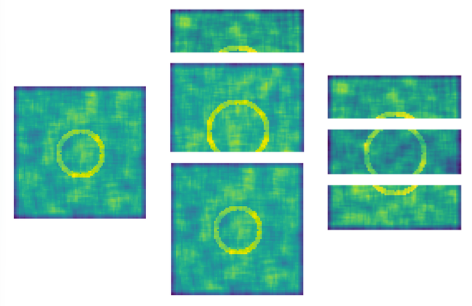
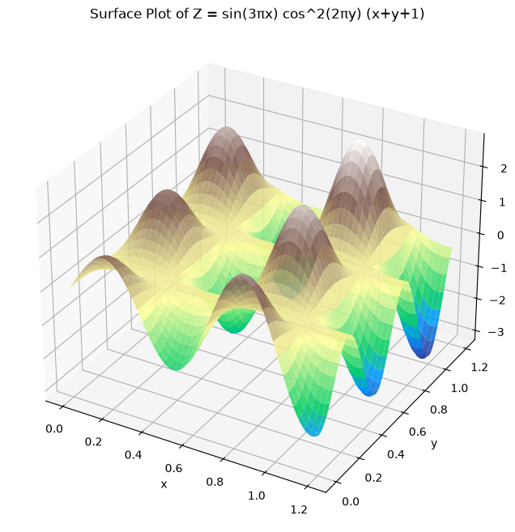
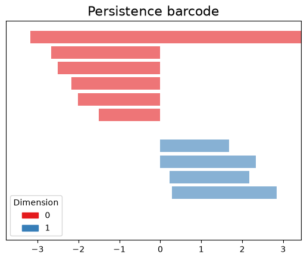
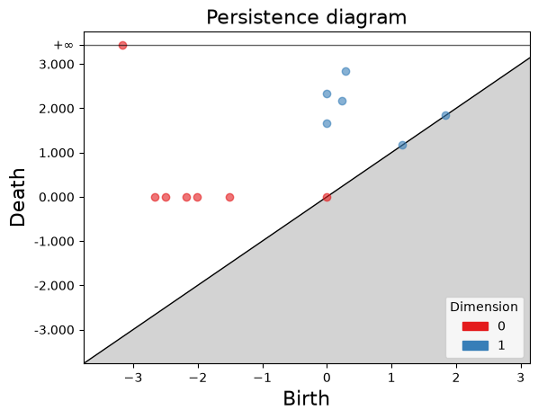
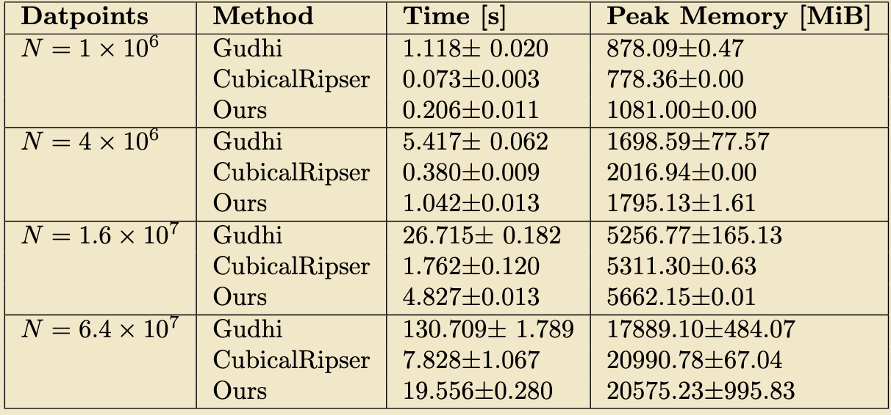

### Pechstre: a **Pe**rsistence method for **Ch**unks **Stre**aming
This project computes the persistent homology of arrays that expand in a streaming fashion, meaning chunks arrive and keep incrementing a base array.

One way to compute an streaming array's persistence is, every time a new chunk is incremented, to re-compute the persistence of the entire array. While this works fine, it does unnecessary work, especially for massive data like maps or videos.

<p align="center">
  
  <br>
  <em><b>Figure 0.</b> Left: base array with center loop. Middle: standard methods process the entire streaming array at each chunk arrival. Right: the proposed method processes each chunk as it arrives, then stitches array boundaries.</em>
</p>

The filtration method used to process the birth and death of the data depends on the modality. For instance:
- 2D arrays, like images, commonly use sublevel/superlevel set filtration based on pixel intensity or a scalar function
- point clouds use distance-based filtration like Vietoris-Rips, Alpha/Delaunay, Čech, or witness complexes
- time series often do sublevel set on the signal, or alternately, undergo time delay (Takens) embedding to turn into a point cloud, after which distance-based filtrations are applied
- Graphs/networks mostly use weight filtrations on edges or nodes

Our method focuses on the sublevel set filtration, using a cubical complex. We compute the H0 and H1 persistence in a row-wise streaming fashion, processing incoming spatial chunks independently, then stitching the old element-new element boundary. The process is as follows.
The repository includes exact streamed-prefix implementations for 1D and 2D.

## Quick start

```bash
python -m pip install -e .
python -m topo.runner --case both
```

**Base scenario:**
1. Take a 2-parameter function like shown in Fig. 1-2 and represent grid as cubical complex (vertex = pixel, edge = connection, face = square between 4 pixels)
2. Sort all grid edges by their vertex value, from lowest to highest
3. H0 (components). Loop forward through sorted edges, use union-find to track connected components. When an edge connects 2 components, the elder component (lower vertex birth value) survives, and the younger dies, creating H0 = [pixel_birth, edge_death]
4. H1 (loops): loop backward through edges (highest to lowest). In this view, each edge acts as barrier between 2 adjacent squares (faces). When a high-value edge is processed, it removes the barrier between 2 faces. If these face components were isolated, removing the edge connects them, meaning a loop has been closed. The loop is born at that edge, and dies at the higher valued face, creating H1 = [edge_birth, face_death]

**Streaming logic** (to avoid re-computing from scratch):

5. new array is appended to existing array grid
6. Feature extraction: instead of re-evaluating everything, the algorithm isolates new internal edges of the new chunk and the stitching edges that cross the boundary between old and new arrays
7. Incremental state resolution: the system sorts and sweeps only these new edges. If an open geometric feature (like a half-loop at the bottom edge of the old array) is completed by the incoming chunk, the boundary-stitching edge triggers a merge in the union-find structure. Path compression instantly resolves the global connectivity (it flattens the chain of pointers so every element points directly to its absolute root). This correctly closes the loop and records the newly formed persistent pair.

To allow the streaming behaviour we maintain 2 arrays:
- `parent` array: 1D disjoint-set mapping elements to their absolute root* (ie, eldest?), allowing boundary conenctivity checks via apth compression
- `birth` array: 1D history tracking the exact birth of all active topological features

*absolute root = in union-find, absolute root is the master element that represents the entire connected component. In our terms, it is the local component with the lowest value (local minimum).
- For H0, it is the pixel with the lowest value (local minimum/birth)
- For H1, it is the face with the highest value (local maximum/death) or the grid's exterior boundary (which is ignored)

<table>
  <tr>
    <td align="center">
      <br>
      <em>Fig. 1: Surface plot of a sample function</em>
    </td>
    <td align="center">
      <br>
      <em>Fig. 2: 2D matrix of function</em>
    </td>
  </tr>
  <tr>
    <td align="center">
      <br>
      <em>Fig. 3: Persistence barcode of the field (Gudhi)</em>
    </td>
    <td align="center">
      <br>
      <em>Fig. 4: Persistence diagram of the field (Gudhi)</em>
    </td>
  </tr>
</table>

We benchmark against the libraries [Gudhi](https://gudhi.inria.fr/python/latest/) and [CubicalRipser](https://github.com/shizuo-kaji/CubicalRipser).

<table>
    <td align="center">
      <br>
      <em>Fig. 5: Benchmarking our method (non-streaming) for time and peak memory </em>
    </td>
</table>

More information is found in the [**paper manuscript**](pechstre_manuscript.pdf), currently under construction.

Fixes and possible extensions:
- adapt algorithm for other dimensions: 1D (code exists in this repo, need to benchmark), 3D
- speedups, ie smarter type casting and less switching
- better memory and array handling, ie handle multiple arrays at once
- hardware: better utilize hardware and parallelize threads/cores
- simplify topological structures, ie via discrete Morse (less accurate, faster)
- change streaming shape; we currently do row-wise incrementing, but consider column-wise, or replacing specific tiles in the array


Datasets:
- Nvidia stock: [source](https://www.kaggle.com/datasets/kalilurrahman/nvidia-stock-data-latest-and-updated?select=NVidia_stock_history.csv)
- Household electricity power consumption [source](https://archive.ics.uci.edu/dataset/235/individual+household+electric+power+consumption)
- Appliances energy prediction [source](https://archive.ics.uci.edu/dataset/374/appliances+energy+prediction)

